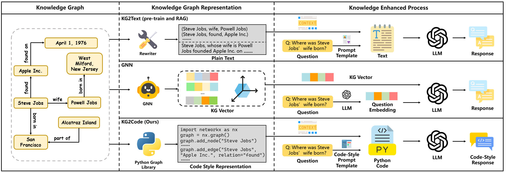

# KG2Code: From Knowledge Graphs to Code for Enhancing Large Language Models

> **Abstract**
Recent research has explored integrating knowledge graphs (KGs) with large language models (LLMs) to enhance their performance on downstream tasks. Despite notable progress, existing methods face key limitations. Most approaches convert KGs into plain text, which fails to preserve their inherent structural information. Others employ adapter modules such as graph neural networks (GNNs) to encode KGs as soft prompts, but these differ from the LLMs’ pre-training paradigm and exhibit poor generalization. To address these issues, we propose KG2Code, a novel framework that transforms knowledge graphs into Python code, a format that LLMs naturally understand and that effectively preserves topological structure. Building on this representation, we design a code-style prompting scheme that reformulates diverse KG-related tasks as the unified code generation problem. Furthermore, we construct a large-scale code-style corpus based on this representation and continue training LLMs to enhance their reasoning and prompt-following abilities. Extensive experiments show that KG2Code substantially outperforms existing KG-enhancement methods on knowledge-intensive tasks, particularly in transfer settings. Our findings demonstrate that code serves as a more expressive and unified medium for integrating structured knowledge, opening a new direction for enhancing LLMs through code-based representation learning.
> 

This is the accompanying code for the paper **KG2Code: From Knowledge Graphs to Code for Enhancing Large Language Models**. 

## Setup
### Environment Setup
```
conda create -n KG2Code python=3.12
conda activate KG2Code
pip install -r KG2Code-requirements.txt
conda create -n tune python=3.10
conda activate tune
pip install -r tune-requirements.txt
conda create -n GNN python=3.8
conda activate GNN
pip install -r GNN-requirements.txt
```
**In this work, we use three different environments. For fine-tuning LLMs, please use the tune environment. For the GNN and GNN+Text baselines, please use the GNN environment. For all other cases, please use the KG2Code environment.**
### LLM Setup
We utlize various LLMs in the experiments, including [Llama-3.1-8B-Instruct](https://huggingface.co/meta-llama/Llama-3.1-8B-Instruct), [DeepSeek-Coder-V2-Lite-Instruct](https://huggingface.co/deepseek-ai/DeepSeek-Coder-V2-Lite-Instruct), [DeepSeek-R1-Distill-Llama-8B](https://huggingface.co/deepseek-ai/DeepSeek-R1-Distill-Llama-8B). Download LLMs to ```pretrain/```.
```
KG2Code/
pretrain/
    ├── Llama-3.1-8B-Instruct/
    ├── DeepSeek-Coder-V2-Lite-Instruct/
    └── DeepSeek-R1-Distill-Llama-8B/                       
```
### Dataset Setup
We evaluate our method on six datasets, [QALD-9-plus](https://github.com/KGQA/QALD_9_plus), [QALD-10](https://github.com/KGQA/QALD-10), [Wikidata5M-Transductive](https://deepgraphlearning.github.io/project/wikidata5m), [Wikidata5M-Inductive](https://deepgraphlearning.github.io/project/wikidata5m), [GrailQA](https://dki-lab.github.io/GrailQA/), and [WN18RR](https://github.com/TimDettmers/ConvE). Download QALD-9-plus to ```KG2Code/inference/KGQA/dataset/QALD-9```. Download QALD-10 to ```KG2Code/inference/KGQA/dataset/QALD-10```. Download Wikidata5M to ```KG2Code/inference/KGC/wikidata5m```. For GrailQA, please download the original [dev set](https://dki-lab.github.io/GrailQA/) to ```KG2Code/inference/KGQA/transfer-KGQA/dataset/grailqa``` and the [2-Hop retrieval results](https://github.com/wuyike2000/CoTKR/tree/main/inference/open/retrieve/2hop/format/grailqa.json) to  ```KG2Code/inference/KGQA/transfer-KGQA/dataset/grailqa```. For WN18RR, please download the [processed data](https://github.com/yao8839836/kg-bert/tree/master/data/WN18RR) to ```KG2Code/inference/KGC/transfer-KGC/dataset/WN18RR```.
```
KG2Code/
└── inference/
    ├── KGQA/
        ├── dataset/
            ├── QALD-9/
                └── qald_9_plus_test_wikidata.json
            └── QALD-10/
                └── qald_10.json
        └── transfer-KGQA/
            └── dataset/
                └── grailqa/
                    ├── grailqa_v1.0_dev.json
                    └── grailqa.json
    └── KGC/
        ├── wikidata5m/
            ├── wikidata5m_all_triplet.txt
            ├── wikidata5m_transductive/
                └── wikidata5m_transductive_test.txt
            └── wikidata5m_inductive/
                └── wikidata5m_inductive_test.txt
        └── transfer-KGC/
            └── dataset/
                └── WN18RR/
                    ├── wordnet-mlj12-definitions.txt
                    ├── train.tsv
                    ├── test.tsv
                    ├── relations.txt
                    ├── relation2text.txt
                    ├── entity2text.txt
                    ├── entities.txt
                    └── dev.tsv
```
## Continual Training
**We provide our fine-tuned KG-Coders lora checkpoints (fine-tuned on code-style corpus) in [KG-Coder.zip](https://drive.google.com/file/d/1hxY7kQag7n3jI5-hzGsLUYDICUyRf83k/view?usp=sharing) and our Text model lora checkpoints (fine-tuned on textual corpus) in [Text-Model.zip](https://drive.google.com/file/d/1FDJY7TuJVWmfoTuj_ovoo_Ysc9AwB-d7/view?usp=sharing). You can download it directly to the following folder and escape the continual training phase. You only need to merge the lora checkpoints into base model.**
### Corpus Construction
**We provide our constructed code-style corpus in [pretrain.zip](https://drive.google.com/file/d/1Y0YD6bsI8VpRyZD2DP3Dht3MwFrUkxg9/view?usp=sharing) and corresponding textual corpus in [pretrain-text.zip](https://drive.google.com/file/d/1spFJ8P7UV90JdyqxS6MRorRmjecQPSyq/view?usp=sharing). You can download it directly to the following folder and escape the following corpus construction steps.**
If you want to generate your corpus, please follow these steps and be ready to spend a lot of money ;)
#### Dict Setup
1. We provide our collected ```endict.pkl``` and ```redict.pkl``` in [dict.zip](https://drive.google.com/file/d/190_njuwwOgQaSWRB0WBvIQDbRe7cn3rG/view?usp=sharing). Please download them into ```KG2Code/pretrain/kgqa``` and ```KG2Code/pretrain/kgc```.
2. We provide the ```entity.txt``` and ```relation.txt``` we used in [data.zip](https://drive.google.com/file/d/1rPOkCsZkC3TixHgRnbJxhBsmxnv5pIJa/view?usp=sharing). Please download them into ```KG2Code/pretrain/kgqa``` and ```KG2Code/pretrain/kgc```.
#### KGQA
1. Go to ```KG2Code/pretrain/kgqa```.
2. Run ```dict_filter.py``` to construct the dict files for the following steps.
3. Run ```subgraph.py``` to generate subgraphs used for training corpus generation.
4. Run ```fact_sparql.py``` to generate sparql for factual questions. Run ```count_sparql.py``` to generate sparql for counting questions. Run ```judge_sparql.py``` to generate sparql for boolean questions.
5. Run ```fact_question.py``` to generate questions from factual sparql. Run ```count_question.py``` to generate questions from counting questions. Run ```judge_question.py``` to generate questions from boolean questions. Run ```merge.py``` to merge all these questions into one file.
6. Run ```cot_multi.py``` to generate the Chain-of-Thought (CoT) reasoning process for these questions.
7. Run ```graph_extend.py``` to extend the groundtruth subgraph of the questions.
8. Run ```corpus.py``` to generate the KGQA training corpus for KG2Code. Run ```corpus_text.py``` to generate the KGQA training corpus for Text baseline.
#### KGC
1. Go to ```KG2Code/pretrain/kgc```.
2. Run ```dict.py``` and ```dict-en-re.py``` to construct the dict files for the following steps.
3. Run ```data_multi.py``` to construct the kgc data used for training corpus generation.
4. Run ```cot_multi.py``` to generate the Chain-of-Thought (CoT) reasoning process for these questions.
5. Run ```corpus.py``` to generate the KGC training corpus for KG2Code. Run ```corpus_text.py``` to generate the KGC training corpus for Text baseline.

Go to ```KG2Code/instruction-tuning```. Run ```merge.py``` to generate training corpus for KG2Code and run ```merge_text.py``` to generate training corpus for Text baseline.
### Instruction-tuning
1. Go to ```KG2Code/instruction-tuning```. Run ```train.sh``` to train LLM. Please modify some key parameters like "llm" and "dataset".
2. After training, please put your lora checkpoints into ```KG2Code/inference/checkpoint-code``` for KG2Code and ```KG2Code/inferece/checkpoint-text``` for Text baseline. For example, please put lora checkpoint for KG2Code based on ```Llama-3.1-8B-Instruct``` into ```KG2Code/inference/checkpoint-code/Llama-3.1-8B-Instruct```.
3. Go to ```KG2Code/inference```. Run ```merge.py``` to merge the lora checkpoint into base LLM.
## Inference
### KGQA
1. Go to ```KG2Code/inference/KGQA/retrieve```.
2. Run ```qald-retrieve.py``` to parse sparql and extract the groundtruth subgraph.
3. Run ```graph-extend-stable.py``` to extend the groundtruth subgraph.
4. Run ```graph-query.py``` to query the names of the entities and relations in subgraph. Please modify some key parameters like . ```entity.pkl``` and ```relation.pkl``` are provided in [dict.zip](https://drive.google.com/file/d/190_njuwwOgQaSWRB0WBvIQDbRe7cn3rG/view?usp=sharing). Please download them directly.
5. Run ```graph-infer.py``` to change the prompt format into code-style.
6. Go to ```KG2Code/inference/KGQA/answer```.
7. Run ```answer-code.py``` to get the results for KG2Code. Run ```answer-text.py``` to get the results for Text baseline. Run ```answer-origin.py``` to get the results for Raw baseline for Llama-3.1-8B-Instruct. Run ```answer-code-direct.py``` to get the results for Raw baseline for DeepSeek-Coder-V2-Lite-Instruct. Run ```answer-r1.py``` to get the results for R1 baseline.
### Transfer-KGQA
We conduct transfer experiments on GrailQA. For retrieval results, we directly use 2-Hop retrieval results from [CoTKR](https://github.com/wuyike2000/CoTKR).
1. Go to ```KG2Code/inference/KGQA/transfer-KGQA```.
2. Run ```preprocess.py``` to process the files.
3. Go to ```KG2Code/inference/KGQA/transfer-KGQA/answer```.
4. Run ```answer-code.py``` to get the results for KG2Code. Run ```answer-origin.py``` to get the results for Raw baseline. Run ```answer-text.py``` to get the results for Text baseline.
5. For the GNN/GNN+Text baselines, please first generate the test files in the required format, and then perform prediction using the fine-tuned Llama-3.1-8B-Instruct model. For detailed instructions, refer to the GNN/GNN+Text section.
### KGC
1. Go to ```KG2Code/inference/KGC/retrieve```. ```entity.pkl``` and ```relation.pkl``` are provided in [dict.zip](https://drive.google.com/file/d/190_njuwwOgQaSWRB0WBvIQDbRe7cn3rG/view?usp=sharing). Please download them directly and put it in ```KG2Code/inference/KGC/retrieve``` and ```KG2Code/inference/KGC/infer```. 
2. Run ```create_dict.py``` to create the dict files for the following steps.
3. Run ```retrieve-2hop.py``` to retrieve the relevant the subgraphs for KGC tasks.
4. Go to ```KG2Code/inference/KGC/infer```.
5. Run ```infer-code.py``` to get the results for KG2Code. Run ```infer-text.py``` to get the results for Text baseline. Run ```infer-origin.py``` to get the results for Raw baseline for Llama-3.1-8B-Instruct. Run ```answer-code-direct.py``` to get the results for Raw baseline for DeepSeek-Coder-V2-Lite-Instruct.
### Transfer-KGC
We conduct transfer experiments on WN18RR. We follow [KG-BERT](https://github.com/yao8839836/kg-bert/tree/master/data/WN18RR) and use the files directly from it.
1. Go to ```KG2Code/inference/KGC/transfer-KGC```.
2. Run ```create_dict.py``` to construct the dict files for the following steps.
3. Run ```retrieve-2hop.py``` to retrieve the subgraph for inference.
4. Go to ```KG2Code/inference/KGC/transfer-KGC/infer```.
5. Run ```infer-code.py``` to get the results for KG2Code. Run ```infer-text.py``` to get the results for Text baseline. Run ```infer-origin.py``` to get the results for Raw baseline.
###  KG2Text Variants
For three varaints of KG2Text (KG-to-Text, Summary, CoTKR), we first collect the corpus from gpt-4o and then instruct tune Llama-3.1-8B-Instruct.
We provide the fine-tuned [lora checkpoints](https://drive.google.com/file/d/1NTUnO1vGSC5dPiF3sToPLrWat3nfJkHL/view?usp=sharing). You can download it and escape the corpus construction phase.
We also provide the [collected corpus](https://drive.google.com/file/d/1bTduLUZQs-wqVtXuLLSd2m47Qm7nG08_/view?usp=sharing). You can download it and instruct tune your own models without collecting training data.
1. Copy the dict file (endict.pkl, redict.pkl, in_en_re.pkl, out_en_re.pkl, in_triple.pkl, out_triple.pkl) from ```KG2Code/inference/KGC/infer``` into ```KG2Code/KR/answer```.
2. Go to ```KG2Code/KR/corpus```.
3. Run ```kg-to-text.py``` to collect the training corpus for KG-to-Text. Run ```summary-kgqa.py``` to collect the training corpus for summary for KGQA. Run ```summary-kgc.py``` to collect the training corpus for summary for KGC. Run ```cotkr-kgqa.py``` to collect the training corpus for cotkr for KGQA. Run ```cotkr-kgc.py``` to collect the training corpus for cotkr for KGC.
4. Run ```merge.py``` to merge the training corpus for KGQA and KGC. You only need to deal with Summary and CoTKR.
5. Go to ```KG2Code/KR/instruction-tuning```. Run ```run_llama.sh``` to instruct tune the model. Please modify the key parameters like "llm".
6. Go to ```KG2Code/KR/rewrite```. Run ```rewrite.py``` to generate the knowledge representation of these baselines. Please modify the key parameters like "KR" and "TASK".
7. Go to ```KG2Code/KR/answer```. Run ```answer-kgqa.py``` for KGQA and run ```answer-kgc.py``` for KGC. Please modify the key parameters like "KR" and "DATASET".
### GNN/GNN+Text
We mainly use the code from [G-Retriever](https://github.com/XiaoxinHe/G-Retriever) to implement GNN/GNN+Text baseline.
#### Data Preprocessing
1. Go to ```KG2Code/G-Retriever-main```.
2. Run the following command.
```bash
python -m src.dataset.preprocess.kgqa
python -m src.dataset.kgqa
```
#### Training
**We provide [our checkpoints](https://drive.google.com/file/d/13WQI_pFElSu0uzZB6JbM6-dnA3cnNzU2/view?usp=sharing). You can use it directly and escape model training.**
1. Go to ```KG2Code/G-Retriever-main```.
2. GNN: 
```bash
export CUDA_VISIBLE_DEVICES=0
export ONLY_GNN=1
python train.py \
  --dataset kgqa \
  --model_name graph_llm \
  --llm_model_path /path/to/LLM \
  --max_memory 24 \
  --batch_size 1 \
  --only_gnn True \
  --eval_batch_size 1
```
3. GNN+Text:
```bash
export CUDA_VISIBLE_DEVICES=0,1
python train.py \
  --dataset kgqa \
  --model_name graph_llm \
  --llm_model_path /path/to/Meta-Llama-3.1-8B-Instruct \
  --max_memory 24,24 \
  --batch_size 4 \
  --eval_batch_size 4 \
  --only_gnn False \
  --llm_frozen True \
  --llm_model_name Meta-Llama-3.1-8B-Instruct
```
#### Inference
1. Go to ```KG2Code/G-Retriever-main```.
2. GNN (take DeepSeek for example):
```bash
export CUDA_VISIBLE_DEVICES=0
export ONLY_GNN=1
python inference.py \
  --dataset kgqa \
  --model_name graph_llm \
  --max_memory 24 \
  --llm_model_path /path/to/DeepSeek-Coder-V2-Lite-Instruct \
  --eval_batch_size 32 \
  --only_gnn True \
  --llm_frozen True \
  --llm_model_name DeepSeek-Coder-V2-Lite-Instruct-GNN \
  --ckpt_path /path/to/best_gnn_ckpt.pth
```
3. GNN+Text (take Llama for example):
```bash
export CUDA_VISIBLE_DEVICES=0,1
python inference.py \
  --dataset kgqa \
  --model_name graph_llm \
  --max_memory 24,24 \
  --llm_model_path /path/to/Meta-Llama-3.1-8B-Instruct \
  --eval_batch_size 12 \
  --only_gnn False \
  --llm_frozen True \
  --llm_model_name Meta-Llama-3.1-8B-Instruct \
  --ckpt_path /path/to/best_llama_ckpt.pth
```
#### Evaluation
1. Go to ```KG2Code/G-Retriever-main```.
2. Run ```eval_gnn.py```. Do not forget to modify the ```FILE_PATH```.
#### Script Introduction
We provide script files to facilitate easier reproduction.
- Training: `run_GNN_only.sh` for GNN and `run_GNN&Text.sh` for GNN+Text.
- Inference: `run_inference.sh`.
- Batch evaluation: `run_Test_all_GNNonly_kgqa.sh` for GNN and `run_Test_all_kgqa.sh` for GNN+Text.
Key Parameters:
```bash
# Model Checkpoints
LLAMA_MODEL_PATH="/path/to/Meta-Llama-3.1-8B-Instruct"
LLAMA_CKPT="/path/to/llama_best.pth"
DEEPSEEK_MODEL_PATH="/path/to/DeepSeek-Coder-V2-Lite-Instruct"
DEEPSEEK_CKPT="/path/to/deepseek_best.pth"
# The evaluation set (located in the Test/ directory)
FILES=("QALD-9.jsonl" "QALD-10.jsonl" "test.json")
# DeepSeek skip list (by stem name, i.e., filename without extension)
SKIP_DEEPSEEK_FILES=("test")
# GPU Card Setting
export CUDA_VISIBLE_DEVICES=0,1
```
**Evaluate on your own file:**  
Place your xxx.jsonl/json file into the Test/ directory and add its filename to FILES=(...). The script will automatically:  
(1) Copy it to tmp_json/&lt;stem&gt;/test.jsonl and create empty train/dev files;  
(2) Preprocess it into an independent cache directory dataset/Test_&lt;stem&gt; to avoid contaminating the main dataset cache;  
(3) Output the results in output/Test/&lt;stem&gt;/&lt;task&gt;/\*.csv.  
**Parameter Reference and Description**
| Parameter | Meaning | Common Values / Examples |
|---|---|---|
| `CUDA_VISIBLE_DEVICES` | Specifies which GPU(s) to use | `0` or `0,1,2` |
| `--max_memory` | GPU memory limits (GB) in the order of devices | Single GPU `24`；Dual GPU `24,24` |
| `--dataset` | Task or dataset type | `kgqa` |
| `--only_gnn` | Whether to use only the GNN module | `True`/`False` |
| `--llm_frozen` | Freeze LLM parameters | Usually `True` |
| `--llm_model_path` | Local directory of LLM weights | `/path/to/Meta-Llama-3.1-8B-Instruct` |
| `--llm_model_name` | Identifier for the LLM (with or without `-GNN`) | `Meta-Llama-3.1-8B-Instruct`、`DeepSeek-Coder-V2-Lite-Instruct(-GNN)` |
| `--ckpt_path` | Path to the best checkpoint produced during training | `/path/to/...checkpoint_best.pth` |
| `--batch_size` | Training batch size | Adjust according to GPU memory |
| `--eval_batch_size` | Inference batch size | Adjust according to GPU memory and model size |
| `--output_dir` | Output directory for inference results | Defaults to a predefined structure if not specified |

**Tips:**
- The number of commas in --max_memory must match the number of GPUs in CUDA_VISIBLE_DEVICES.
- If you encounter an OOM (Out-Of-Memory) error, reduce batch_size / eval_batch_size or decrease the number of GPUs used.
- Mismatched weight or model paths can cause loading errors — ensure that --llm_model_name and the checkpoint naming are consistent (e.g., whether -GNN is included).
## Contact
Please consider creating a new issue. We will respond to your questions within a few days.